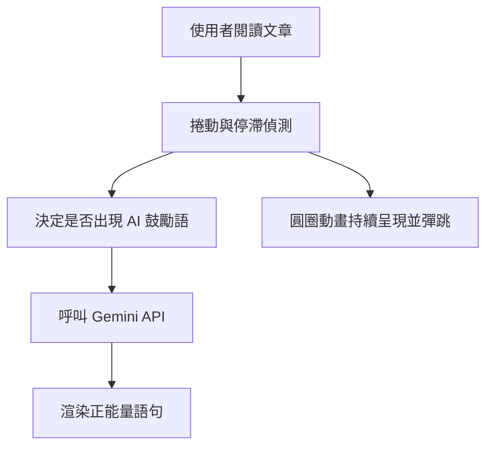

# FocusMate 專注夥伴：針對 ADHD 學習情境的 Chrome 插件

## 📌 專題簡介

**FocusMate** 是一款為 ADHD 學習者設計的 Chrome 擴充功能，透過網頁前景的互動動畫與 Gemini AI 正能量回應，協助使用者進入專注狀態，改善學習過程中容易分心的困擾。插件提供溫柔的語句鼓勵與視覺動態回饋，成為陪伴學習的專注夥伴。

---

## 🎯 專題目標

* 協助 ADHD 使用者維持閱讀與學習節奏
* 提供視覺互動動畫與語意鼓勵回饋
* 實作可部署的 Chrome 插件，整合 Gemini API 回應系統

---

## 🧠 使用情境範例

1. 使用者開啟一篇網頁文章閱讀
2. 插件自動偵測網頁捲動與閱讀進度
3. 畫面上浮現 10 顆會彈跳、互相撞擊的圓圈動畫，作為視覺陪伴
4. 每隔一段時間，Gemini API 根據使用者活動情形，浮現透明正能量語句：

   * 「你今天也在努力，真的很棒！」
   * 「保持節奏，我一直都在這裡！」

---

## 🔧 技術架構

| 模組                   | 功能        | 說明             |
| -------------------- | --------- | -------------- |
| Content Script       | 插入圓圈動畫與語句 | 動態渲染畫面元素並顯示浮語  |
| JavaScript (Web API) | 捲動與活動偵測   | 判斷使用者是否持續閱讀或停滯 |
| Gemini API           | 正能量語意生成   | 依據進度動態生成鼓勵語句   |
| manifest.json        | 擴充功能描述檔   | 定義插件權限與結構      |
| HTML / CSS           | 畫面樣式與定位   | 設計圓圈樣式與文字浮出動畫  |

---

## 🔄 互動流程圖

---

## 🔍 文獻支持與說明

### 1. TikTok Dual Video 效應

TikTok 流行的“雙畫面”影片為 ADHD 者提供多重感官刺激，增加多巴胺分泌，保持觀看者專注力 (WIRED, 2023)。

### 2. PDF to Brain Rot 討論

這類“搭配聲音與簡單動畫”的學習方式，對某些學習障礙者有效幫助維持注意力 (Parents.com, 2024)。

### 3. 動態背景與疲勞感關聯

研究發現適度有趣、低認知負擔的動態背景有助降低心理壓力與疲勞感 (Lifewire, 2024)。

---

## 🌍 參考資料

* Wired: [https://www.wired.com/story/tiktok-dual-videos-attention-spans/](https://www.wired.com/story/tiktok-dual-videos-attention-spans/)
* Parents.com: [https://www.parents.com/pdf-to-brain-rot-trend-8757028](https://www.parents.com/pdf-to-brain-rot-trend-8757028)
* Lifewire: [https://www.lifewire.com/videoconference-fatigue-8717575](https://www.lifewire.com/videoconference-fatigue-8717575)

---

FocusMate 將給予使用者一個溫暖而不干擾的陪伴空間，讓他們即使容易分心，也能被輕柔地拉回專注軌道，重新建立與內容的連結。
